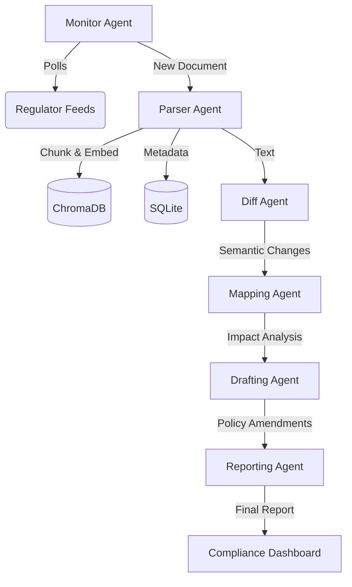

# ACRIS - Autonomous Compliance & Regulatory Intelligence System

ACRIS (Autonomous Compliance & Regulatory Intelligence System) is a technical framework for automated regulatory discovery, semantic analysis, and policy mapping. It provides an end-to-end pipeline for converting raw regulatory feeds into actionable intelligence and policy amendments.

---

## 1. Core Architecture & Orchestration

ACRIS is implemented as an event-driven, multi-service architecture coordinating six specialized autonomous agents.

### Infrastructure Topology
The system requires the following services to be active:
- **API Gateway (FastAPI)**: Serves as the central entry point and agent orchestrator.
- **Message Broker (Redis)**: Facilitates communication between the API and background workers.
- **Task Queue (Celery)**: Handles asynchronous agent pipelines and recurring scraping tasks.
- **Vector Engine (ChromaDB)**: Provides semantic storage and retrieval for regulatory documents and internal policies.
- **Relational Metadata (SQLite)**: Stores deduplication states, seen URLs, and system-wide decision logs.
- **Frontend Dashboard (Next.js)**: Provides real-time visibility into task progress and agent findings.

---

## 2. The Agentic Pipeline (Deep Dive)

The system utilizes a 6-agent Directed Acyclic Graph (DAG) for document processing.

### 2.1 Monitor Agent (`monitor.py`)
- **Discovery Mechanism**: Uses `BeautifulSoup4` to poll RBI and SEBI publication indices.
- **Deduplication**: Implements a MD5 hashing strategy on URLs, stored in `data/seen_urls.db` to prevent redundant processing.
- **Early Warning Extraction**: Utilizes `ModelRouter` to scan consultation papers and drafts, extracting urgenct levels and probability metadata before finalization.

### 2.2 Parser Agent (`parser.py`)
- **Semantic Chunking**: Uses `RecursiveCharacterTextSplitter` with specialized separators (`\n\n`, `\n`, `. `, ` `) to preserve the integrity of regulatory "SHALL/SHALL NOT" obligations.
- **Normalization**: Standardizes PDF-extracted text by removing non-ASCII characters and normalizing whitespace.
- **Metadata Injection**: Each chunk is tagged with its source ID, issuing body, publication date, and status (Active/Superseded).

### 2.3 Diff Agent (`diff.py`)
- **Logic**: Employs `difflib.SequenceMatcher` to generate structured JSON comparisons between different versions of long-form circulars.
- **Classification**: Detects `addition`, `deletion`, and `modification` events at the paragraph level to provide a granular delta for compliance review.

### 2.4 Mapping Agent (`mapping.py`)
- **Semantic Alignment**: Projects regulatory diffs into a 384-dimensional vector space targeting the internal policy collection.
- **Heuristic Filtering**: Filters matches based on policy taxonomy (e.g., KYC, Lending, Security) to ensure relevance.
- **Impact Labeling**: Maps findings to internal policy IDs with a "High/Medium/Low" relevance score.

### 2.5 Drafting Agent (`drafting.py`)
- **LLM Context**: Injects the internal policy clause, the regulatory change text, and the full circular context into a legal drafting prompt.
- **Constraints**: Enforces legal tone preservation and explicit citation of the new Circular ID.
- **Human Review Gate**: Automatically flags drafts for human review if the upstream confidence score falls below a set threshold (default 80%).

### 2.6 Reporting Agent (`reporting.py`)
- **Synthesis**: Compiles metadata, diffs, mappings, and drafts into a unified Markdown report.
- **Urgency Calculation**: Computes priority (HIGH/MEDIUM/LOW) based on the proximity of the regulatory effective date.
- **Audit Logging**: Generates a unique report hash for immutable traceability.

---

## 3. Intelligence Engine & Routing

### Model Routing Logic (`llm_config.py`)
ACRIS implements a "Model Router" pattern for high-fidelity fallback:
1. **Primary Model**: Ollama (`llama3.1:8b`) with a 10s timeout.
2. **Fallback Model**: OpenAI (`gpt-4o-mini`) via API.
3. **Trigger Conditions**:
   - Connection failure to local Ollama instance.
   - Inference timeout (>10s).
   - Confidence score < 70%.

### Confidence Scoring Hierarchy
- **Low Confidence (<65%)**: Agent output is blocked; UI prompts for manual document review.
- **Medium Confidence (65-80%)**: Output is permitted but flagged with "Human Review Required".
- **High Confidence (>80%)**: Output is presented as an automated drafting recommendation.

---
## 4. System Architecture

ACRIS is built on a high-availability, event-driven architecture designed for accuracy and traceability.

### Multi-Agent Orchestration Pipeline
The system utilizes a 6-agent autonomous pipeline to ensure data integrity:



### Technology Stack
- **Orchestration**: LangChain 0.2.x with Custom Agentic Loops
- **Intelligence**: Ollama (Llama 3.1:8b) with GPT-4o-mini Fallback
- **Vector Engine**: ChromaDB (Semantic + BM25 Hybrid)
- **Message Broker**: Redis + Celery for Async Task Processing
- **Frontend**: Next.js 15 (App Router) with Framer Motion animations
- **Backend**: FastAPI with SRE-grade logging and exception handling

## 5. Data Architecture & Schema

### SQLite Reference (`data/seen_urls.db`)
| Column | Type | Description |
| :--- | :--- | :--- |
| `url_hash` | TEXT (PK) | MD5 Hash of the document source URL |
| `status` | TEXT | 'final' or 'draft' |
| `early_warning_flag` | BOOLEAN | Indicates draft regulatory intelligence |
| `urgency` | TEXT | High, Medium, Low (for drafts) |

### Decision Audit Trail (`data/decision_logs.db`)
| Column | Type | Description |
| :--- | :--- | :--- |
| `agent_name` | STRING | The agent calling the LLM |
| `confidence_score` | FLOAT | Score (0-100) returned by the scorer |
| `fallback_triggered` | STRING | "true" if OpenAI was used |
| `processing_time` | FLOAT | Time in seconds for entire inference loop |

---

## 6. API Reference Guide

### Regulatory Intelligence
- `POST /api/ask`: Query the regulatory corpus (Body: `{"query": "..."}`)
- `GET /api/stats`: Retrieve aggregate circular and conflict counts.
- `GET /api/conflict-map`: Fetch the NetworkX graph nodes and edges for UI visualization.

### Pipeline Control
- `POST /api/ingest`: Trigger a discovery run and spawn agent pipelines.
- `GET /api/tasks`: List all active and historically tracked pipelines.
- `GET /api/task/{id}`: Detailed state of a specific task (Parsing -> Indexing -> Analysis).

### SRE & Health
- `GET /health`: Basic connectivity check.
- `GET /api/decisions`: Retrieve the audit trail for agent decisions.

---

## 7. Infrastructure & SRE Operations

### Environment Configuration
The system assumes the existence of a `.env` file containing:
```env
OLLAMA_BASE_URL=http://localhost:11434
REDIS_URL=redis://localhost:6379/0
CELERY_BROKER_URL=redis://localhost:6379/0
OPENAI_API_KEY=sk-... # Optional fallback
```

### Unified Deployment (Windows)
We provide a PowerShell orchestration script to launch the full stack in parallel:
```powershell
.\start_acris.ps1
```
The script initializes Redis, starts the Celery worker, mounts the FastAPI server via Uvicorn, and boots the Next.js development server.

### SRE Reliability Patterns
- **Exponential Backoff**: Critical agent calls are wrapped in `tenacity` retry loops.
- **Agent Health Logs**: SRE-grade logging to `logs/agent_health.log` for failure trace analysis.

---
*Built for Regulatory Intelligence. Optimized for Traceable Compliance.*

